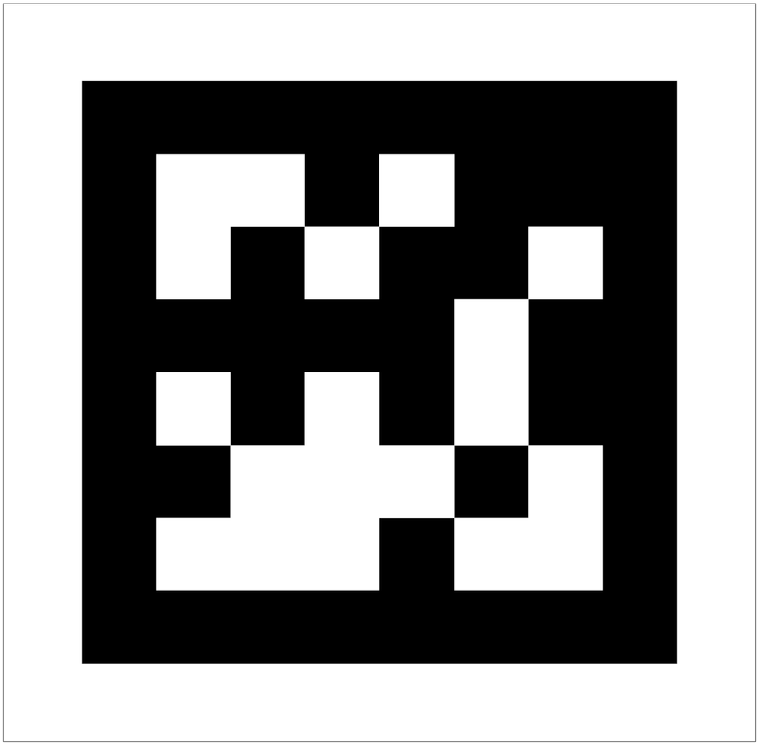
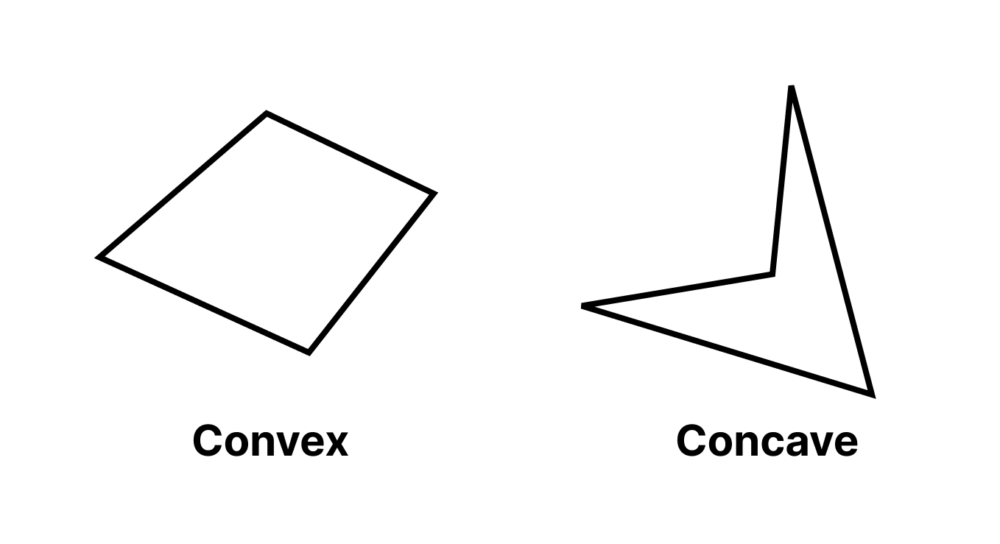
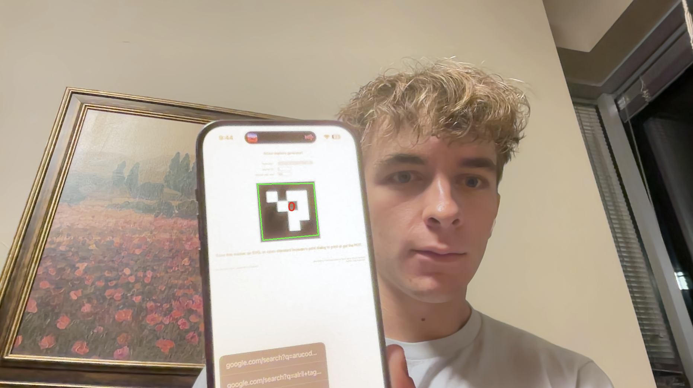

# April Tag Detection

## Project Goal

The goal of this project was to develop a system capable of detecting and identifying AprilTags within video frames captured in real-time. AprilTags are a type of fiducial marker used widely in robotics and augmented reality for precise localization and object tracking. Recognizing and interpreting these tags allows robots to understand their environment spatially and interact with it more effectively. An April Tag looks like a square with a black border. On the inside of the border are black and white "mini-squares" which represent the code of that particular april tag.

<div style="text-align: center">
    
</div>

If the side lengths of the April Tag is already known, they can be used to extract a position of the camera viewing them (if the camera intrinsics and distortion are also known). In this project, we only focus on detecting the tags using functions provided in OpenCV.

OpenCV already has a robust April Tag detection library, but creating one from scratch also allows us to detect custom markers that don't follow a coding scheme or shape included in OpenCV.

## Solution and Methodology

The problem was approached by utilizing the OpenCV library and Python programming language, leveraging computer vision and image processing techniques to detect AprilTags. Our detection script follows a pipeline that is defined below:

### Detection Algorithm

### Binary Thresholding

The video frames are converted to grayscale to simplify the detection process since color information is not necessary for tag detection. A binary threshold is then applied to the grayscale image to create a high-contrast image that is easier to analyze for contours. The threshold is decided based on the average brightness of the image. This is so that, in very dark or light environments, not every pixel is characterized as all black or all white.

```python
# Convert it to grayscale
gray_image = cv2.cvtColor(frame, cv2.COLOR_BGR2GRAY)

# Get the average brightness value of pixels in the frame.
# This is our threshold for binary thresholding.
average_brightness = cv2.mean(gray_image)[0]

# Apply binary thresholding to the frame
ret, binary_image = cv2.threshold(
    gray_image, average_brightness, 255, cv2.THRESH_BINARY
)
```

### Contour Detection:

OpenCV's contour detection methods are used to find the outlines of shapes in the binary image, which may represent the borders of an AprilTag. The contours are a series of points which define a detected border. In this case, we use the RETR_TREE and CHAIN_APPROX_SIMPLE configuration for the findContours function.

```python
# Find contours in frame
        contours, hierarchy = cv2.findContours(
            binary_image, cv2.RETR_TREE, cv2.CHAIN_APPROX_SIMPLE
        )
```

### Rejection of Small Contours

If a contour length is under a certain threshold, we skip processing it. The reasoning behind this is to save processing resources for contours that are more likely to be April Tags.

```python
# Calculate the arc length (perimeter) of the contour
contour_perimeter = cv2.arcLength(contour, True)

# Reject contours that are too small
if (
    contour_perimeter < CONTOUR_PERIMETER_THRESHOLD
    and PERIMETER_TOO_SMALL_CHECK
):
    continue
```

### Quadrilateral Approximation:

Using cv2.approxPolyDP, contours are simplified to polygons. The polygon simplication must be tuned so that the polygon is not too granular or too general. Ideally, quadrilateral contours will simplify down to a polygon with four sides. The parameter that controls this is epsilon, which is determined by a constant and the perimeter of the contour. If the contour perimeter is larger, we want to the contour smoothing to be less granular and vice versa with smaller perimeters. If a polygon has four sides, we have detected a quadrilateral and continue processing.

```python
# Use the arc length to help determine the 'epsilon' parameter
# which determines how much the contour is simplified
epsilon = LINE_SMOOTHING_EPSILON * contour_perimeter

# Use approxPolyDP to simplify the contour
approximated_contour = cv2.approxPolyDP(contour, epsilon, True)

# If the contour is not a quadrilateral, skip it
if len(approximated_contour) != 4:
    continue
```

### Rejection of Concave Quadrilaterals

<div style="text-align: center">
    
</div>

April Tags will never show up as concave quadrilaterals, they will always be convex; therefore, we should reject all concave quadrilaterals before processing them further to save resources. To determine if a quadrilateral is concave, we use an algorithm where we walk along the edges of the quadrilateral, treating them as vectors. So, vertex A -> vertex B would represent the vector AB and vertex B -> C would represent the vector BC. If we take the cross product of these two vectors, we can look at the sign of the output the determine if the vectors are making a clockwise or counterclockwise turn. If not all four vector pairs have the same sign for their cross products, we know that the quadrilateral is concave, therefore we reject it.

```python
# Ensure the vertices are ordered consistently (e.g., clockwise or counterclockwise)
    # vertices should be a list of points, e.g., [(x1, y1), (x2, y2), (x3, y3), (x4, y4)]
    n = len(vertices)
    sign = 0
    for i in range(n):
        p1 = vertices[i]
        p2 = vertices[(i + 1) % n]
        p3 = vertices[(i + 2) % n]

        # Compute vectors for the edges: v1 from p1 to p2, v2 from p2 to p3
        v1 = np.array(p2) - np.array(p1)
        v2 = np.array(p3) - np.array(p2)

        # Calculate the Z component of the cross product (v1 x v2)
        cross_product_z = np.cross(v1, v2)
        # If the sign changes, we have a concave corner
        if i == 0:  # First corner, just record the sign
            sign = np.sign(cross_product_z)
        else:
            if np.sign(cross_product_z) != sign:
                return True  # Concave corner detected

    return False  # No concave corners detected
```

### Homography:

In order to detect what value the "mini-squares" are in the April Tag, we have to sample them as if they were a square grid. The problem is, our April Tag might be distorted and may not appear as a flat square in our image. This is where the concept of a homography is. What a homography does, in our case, is take a perfect square, and creates a 3x3 matrix which acts a transformation from the perfect square to the distorted quadrilateral. This way, we can find the coordinates which on the quadrilateral which are equivalent to the coordinates of a grid on the square, allowing us to sample the correct spots on our quadilateral to see if it a known April Tag or not. We simply used the OpenCV homography function.

```python
# Find the homography matrix from a square to the detected quadrilateral.
# This homography helps us sample points in the quadrilateral in a grid like
# fashion.
square_to_quad_homography = homography(vertices)
```

After we get the homoegraphy that represents the transform from our square to the quadrilateral, we can use it to get the coordinates on the quadrilateral that represent a grid. Each point on the grid is placed at the center of each "mini-square" on the April Tag so we have the best shot at sampling its value.

```python
# Returns the corresponding coordinates of a grid of points from a square to
# the detected quadrilateral.
marker_matrix_coords = apply_homography_to_grid(
    DST_GRID, square_to_quad_homography
)
```

In the apply_homography_to_grid function, we apply the homography straight to the matrix of grid coordinates. This is much more efficient that using a for loop which helped with the frame rate of our script.

```python
def apply_homography_to_grid(grid_points, homography):
    """
    Applies a homography matrix to a grid of points.

    Args:
        grid_points (numpy.ndarray): A grid of points in 3D space, with shape (rows, cols, 3).
        homography (numpy.ndarray): A 3x3 homography matrix.

    Returns:
        numpy.ndarray: The transformed grid of points in 2D space, with shape (rows, cols, 3).
    """

    # Flatten the grid to a (N, 3) matrix where N is grid_size^2
    flat_grid_points = grid_points.reshape(-1, 3).T

    # Apply homography matrix to all points using matrix multiplication
    # The result will be in homogeneous coordinates
    transformed_points_homogeneous = homography @ flat_grid_points

    # Normalize points to convert from homogeneous to Cartesian coordinates
    transformed_points_cartesian = (
        transformed_points_homogeneous[:2, :] / transformed_points_homogeneous[2, :]
    )

    # Reshape the points back to the original grid shape
    transformed_grid = transformed_points_cartesian.T.reshape(
        grid_points.shape[0], grid_points.shape[1], 2
    )

    return transformed_grid
```

Lastly, see what value the pixels are at each of these points.

```python
# Extract the pixel values from the binary image at the marker matrix coordinates
marker_matrix = extract_pixel_values(binary_image, marker_matrix_coords)
```

### Code Matching:

Pixel values are extracted from the warped quadrilateral, and the AprilTag code is decoded by matching it against a predefined dictionary of tag codes.

The marker_matrix variable is a matrix that represents the values of the "mini-squares" in our detect quadrilateral. Since the border pixels of this matrix are always black, we can get rid of them which helps with false negatives since the borders of the contours aren't always exact.

```python
CODES_4X4 = {
    "0": np.array(
        [[255, 0, 255, 255], [0, 255, 0, 255], [0, 0, 255, 255], [0, 0, 255, 0]]
    )
}
def match_code(code):
    """
    Matches a given 4x4 april tag matrix with the dictionary of known codes.

    Args:
        code (numpy.ndarray): A 4x4 numpy array representing the code to be matched.

    Returns:
        str: The key of the matched code in the CODES_4X4 dictionary, or None if no match is found.
    """
    for key in CODES_4X4:
        for i in range(4):
            if np.array_equal(code, np.rot90(CODES_4X4[key], i)):
                return key
    return None
```

If a code matches, we draw its quadrilateral to the livefeed and draws text on it that shows its code value. (Note the small 0 in red in the middle of the April Tag).

<div style="text-align: center">
    
</div>

It even works well with very distorted April Tags.

<div style="text-align: center">
    
</div>

## Design Decision

### Homographys

At first we began by warping our quadrilateral into the square image and then sampling coordinates along the square grid. However, we found that the warping of the quadrilateral using the OpenCV function distorts to the warped image to the point where sampling the "mini-squares" inside the April Tag is very inconsistent.

Instead of warping the image, we simply applied the homography to the grid of points on the square to the quadrilateral and directly sampled the points. This completely got rid of the need to warp the quadrilateral into the square, avoiding any distortion.

We also included a design decision to filter out certain contours and quadrilaterals that were deemed unfit to be April Tags to save on processing resources. The checks that we made were rejecting contours that were too small and rejecting quadrilaterals that were concave.

## Challenges

During development, the main challenge we encountered had to do with matrix multiplication.

Converting loops to matrix multiplications can be straight forward in certain contexts, but we had some trouble wrapping our heads around applying a 3x3 transformation to a NxN grid. However, after white boarding some examples with real numbers, we were able to implement it with more confidence in our code.

Other than that, OpenCV made it very easy to prototype ideas, and any other algorithms that we had to use such as finding the concaveness of a quadrilateral were readily available online.

## Improvements with More Time

With more time, the project could be improved by:

### Create Custom Markers

With the way we structured our code, it is theoretically possible to implement detection for custom markers with shapes such as circles or arrows which may be useful in certain scenarios where square April Tags might not work.

### Machine Learning

Implementing a machine learning-based approach for tag detection could improve robustness against noise and lighting variations. Popular algorithms include feature matching which is a great application for detecing April Tags since the tags have defined corners which is perfect for feature matching algorithms that use corners as prominent features.

### Rigorous Variable Environment Testing

Our team didn't have enough time in the end to setup rigorous testing for different distortions, lighting conditions, and false positive testing. If we had time, we would do grid testing with different constant parameters and enabling/disabling certain rejections while changing the environment. However, we were able to do timing analysis to see what changes to the code made improvements to the delay of the image processing.

## Learning

Our team wasn't very interested in the nitty gritty math behind these algorithms, but was more interested in creating something out of tools that already exist that could be used to create novel marker detection as mentioned in the improvements. We found that, with simple solutions to the problem of marker tracking, we were able to come up with a relatively fast and robust system of tracking April Tags. From this, we acquired some tools in our computer vision tool belt that we can use for projects down the road such as homographys, contour/polygon detection, matrix multiplication optimization, and rejection filters. This project ended up being very enjoyable since we didn't run into many pythonic roadblocks, but rather ran into design challenges which took more of our engineering/creative side to solve.
